# TripOnPlan 

작업기간 : 2022-10-21 ~ 2022-11-18 

총 인원 : 7명

프로젝트 설명 : 숙박 예약 서비스와 여행 일정 만들기를 한 번에 이용할 수 있는 여행 사이트 

사용자용 주소 : http://www.triponplan.shop/main.do

관리자용 주소 : http://www.triponplan.shop/admin

사용자 아이디 : user222 비밀번호 : 1111 

호스트 아이디 : host01 비밀번호 : 1111

관리자 아이디 : manage 비밀번호 : 1111

---
### 🛫 프로젝트 팀원

|**Name**|**GitHub & Email**|
|----|----------------|
|**김예지**| |
|**김도형**| |
|**장승연**| |
|**김태수**| |
|**윤상호**| |
|**현성규**| |
|**강석영**| |

 

### 개발 일정 🗓️

1.  1주차 - 주제선정 , 주제 관련 사이트 참고 , 프로토타입 제작 , 역할 분담 
2.  2주차 - 기능구현
3.  3주차 - 기능구현 , 프론트 작업 , 테스트 
4.  4주차 - 도메인 추가 , 최종 통합 

### 개발 환경 🖥️

**FRONT** - HTML/CSS/JS AJAX Bootstrap 

**BACK** - java8 Spring MyBatis Apache Tomcat MariaDB

**API** - TourAPI coolSMS kakao Import 

**TOOL** - Spring Tool Suite 3 visual studio code GitHub

### 프로젝트에 적용한 데이터 베이스 구조표 (ERD) 📌

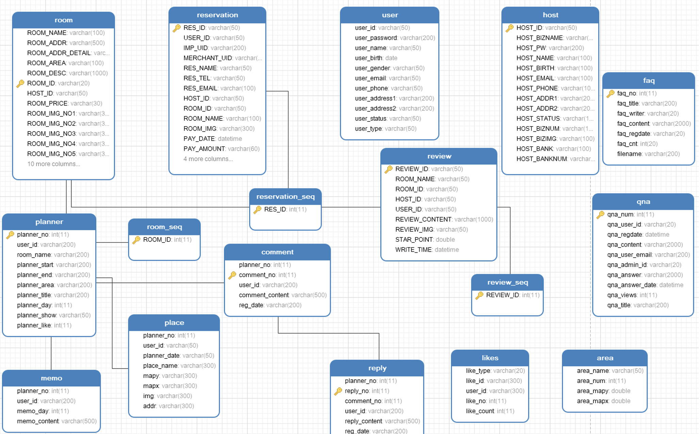

### 사이트 주요 UI / UX

메인 페이지

로그인 페이지

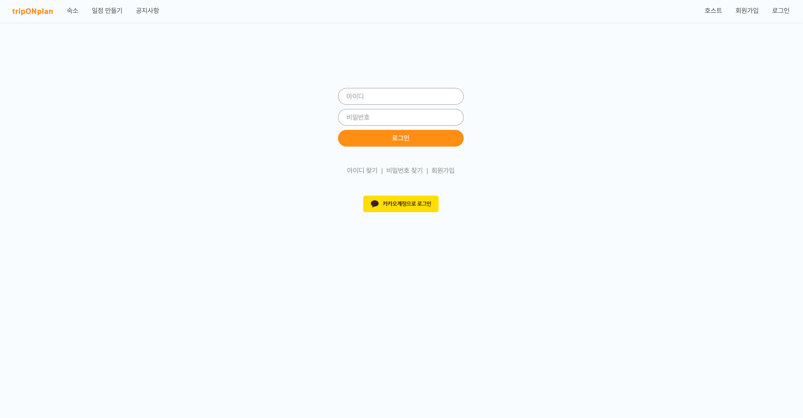

플래너 등록 첫번째 페이지 여행 정보 등록

1. 날짜 입력

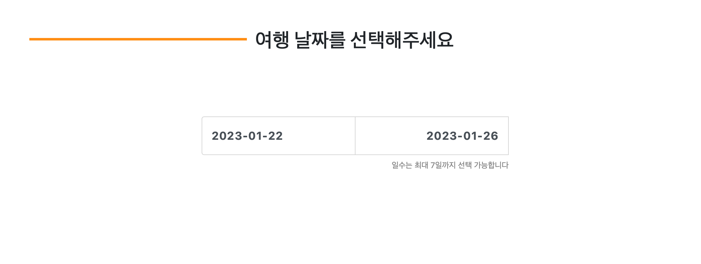

2. 지역 선택 

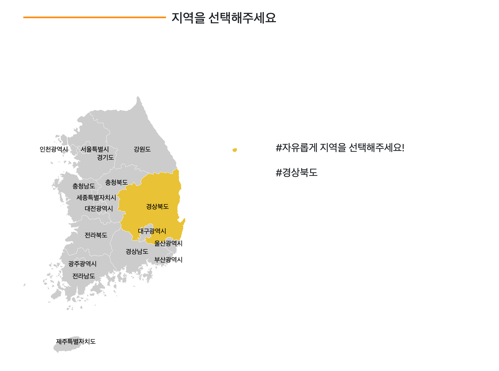

3. 인원수 선택 

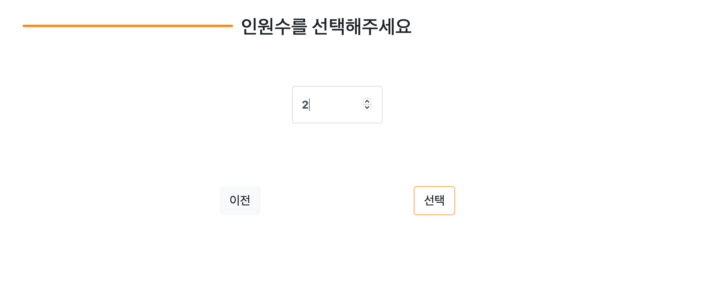

정보 입력 기반으로 플래너 등록 두번째 페이지 이동 

☑️ 총 5가지 카테고리로 명소 등록이 가능함  

☑️ 일자별로 메모 할 수 있음 

☑️ 지역을 변경하여 해당 지역의 명소 검색 , 등록 가능 (TourAPI를 이용하여 실제 관광명소 검색 가능)

☑️ 전체공개 비공개 여부를 선택하여 여행 일정을 공유 할 수 있음

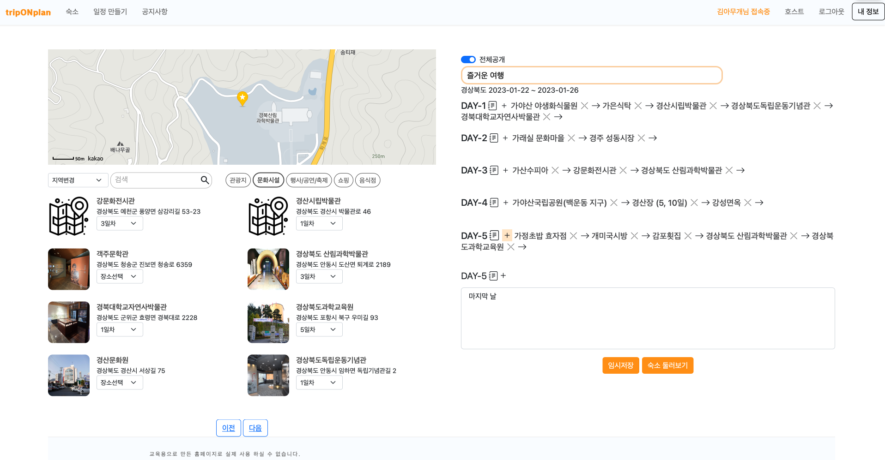

내가 작성한 플래너 확인 (마이페이지)

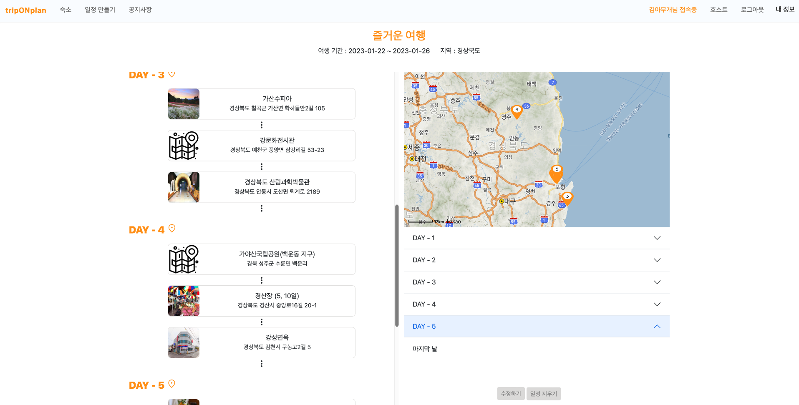

다른 사람이 작성한 플래너 확인 (플래너 게시판)

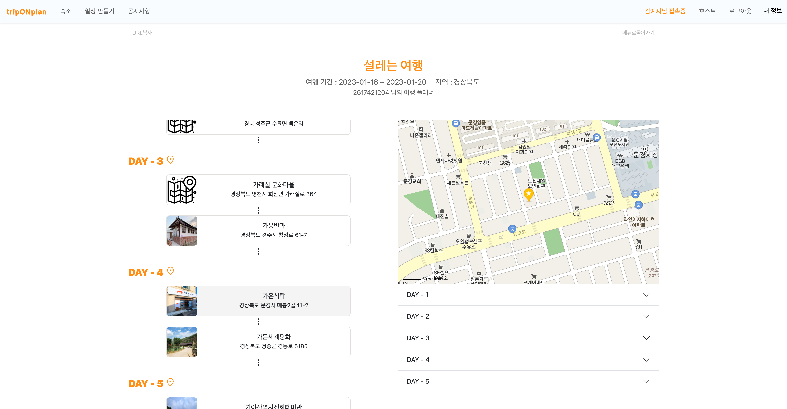

좋아요 댓글 대댓글 기능 

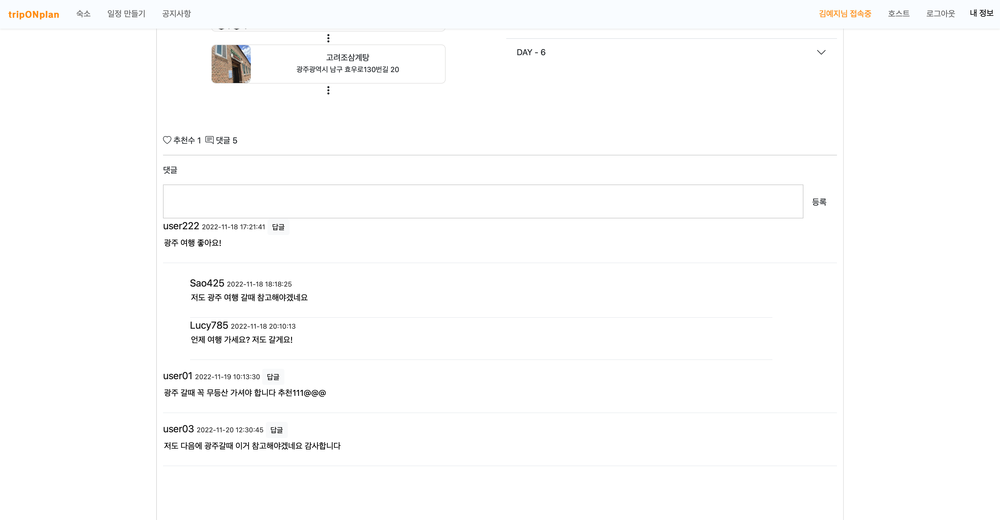

현재 예매 가능한 숙소 리스트 

☑️ 상세 검색 가능 

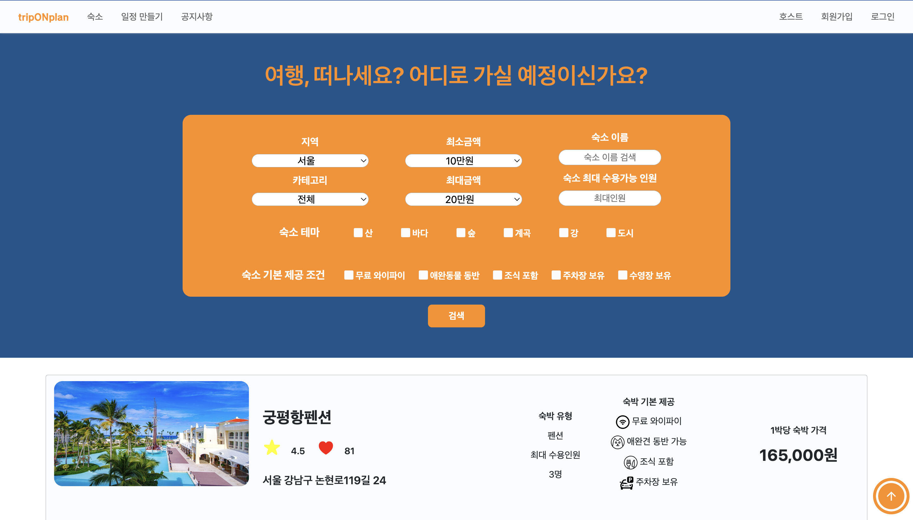

숙소 상세 페이지 

☑️ 좋아요 기능 

☑️ 별점 확인 

☑️ 리뷰 확인

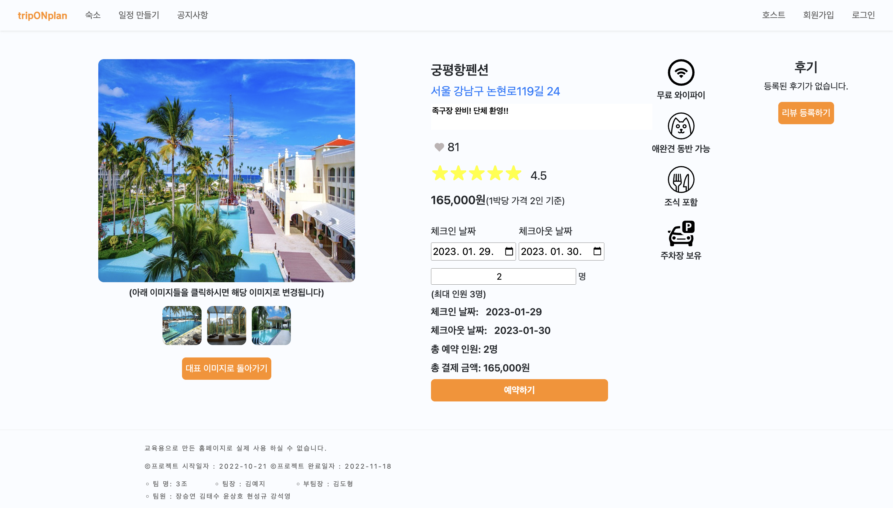

숙소 결제 페이지 

☑️ 이름 , 전화번호 , 이메일 수정 가능

☑️ Import를 이용한 결제 시스템 기능 (테스트 모드로 자정에 자동 환불됨)

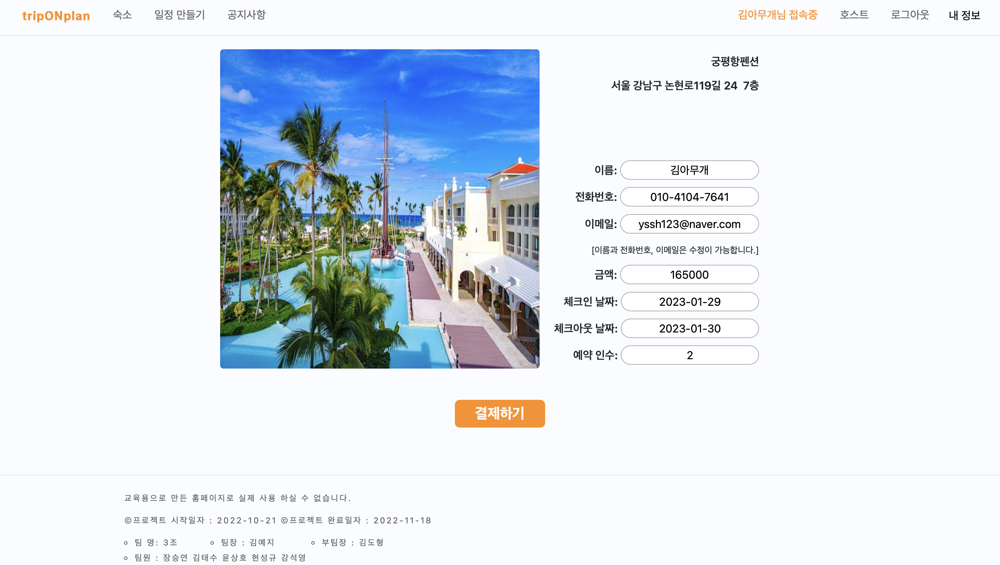

사용자 숙소 결제 내역 리스트

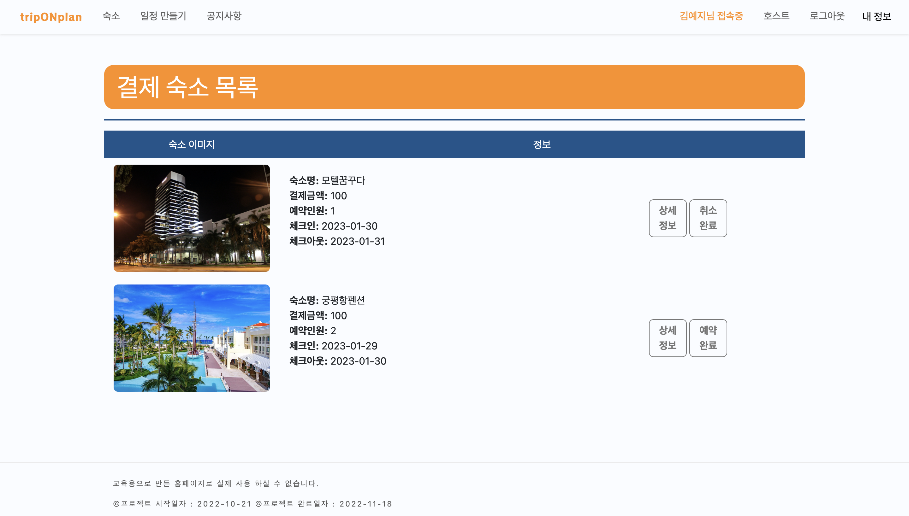

숙소 결제 상세 페이지 

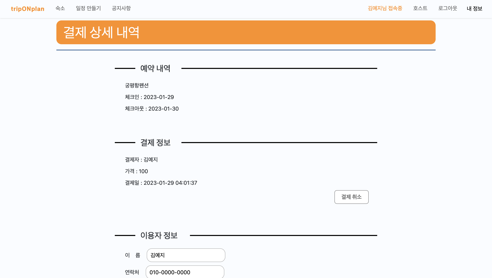

호스트 전용 로그인 페이지

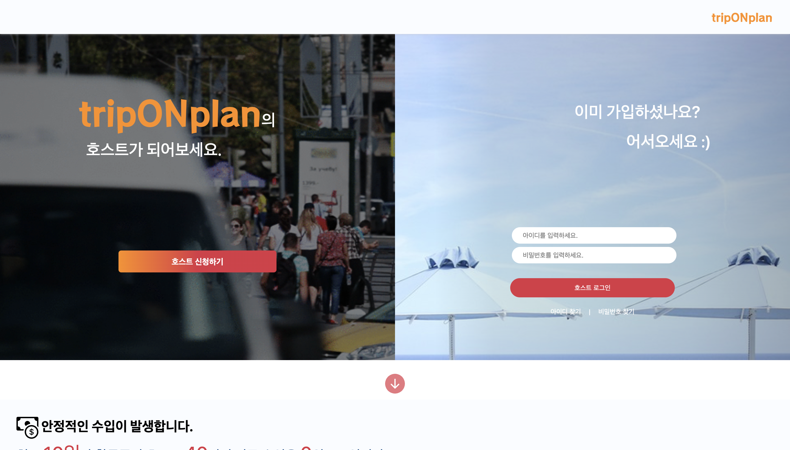

☑️ 전체 호스트의 현재 거래 현황 확인 가능 

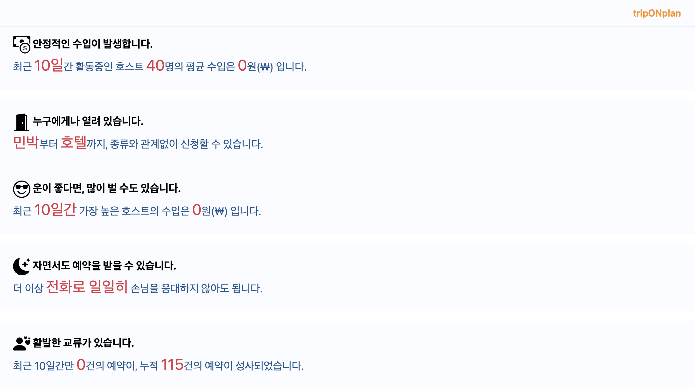

호스트 전용 메인 페이지 

☑️ 숙소 등록 수정 삭제 가능 

☑️ 리뷰 , 예약 현황 확인

☑️ 최근 매출 , 인기많은 숙소를 표를 통하여 확인 

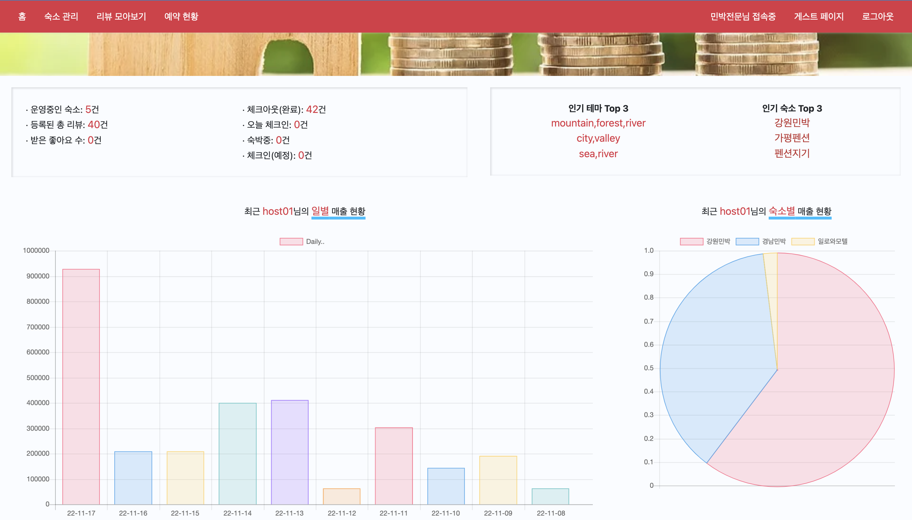

관리자용 메인 페이지 

☑️ 회원 관리 및 호스트 관리 

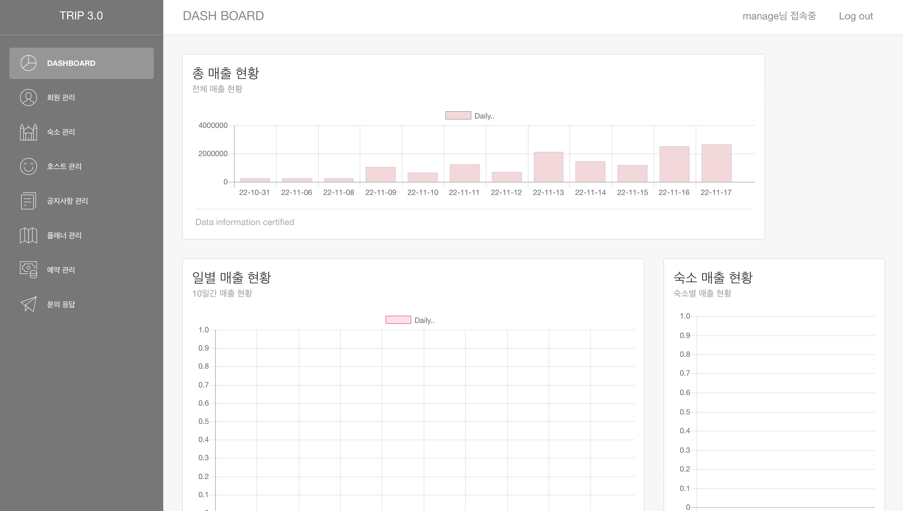

